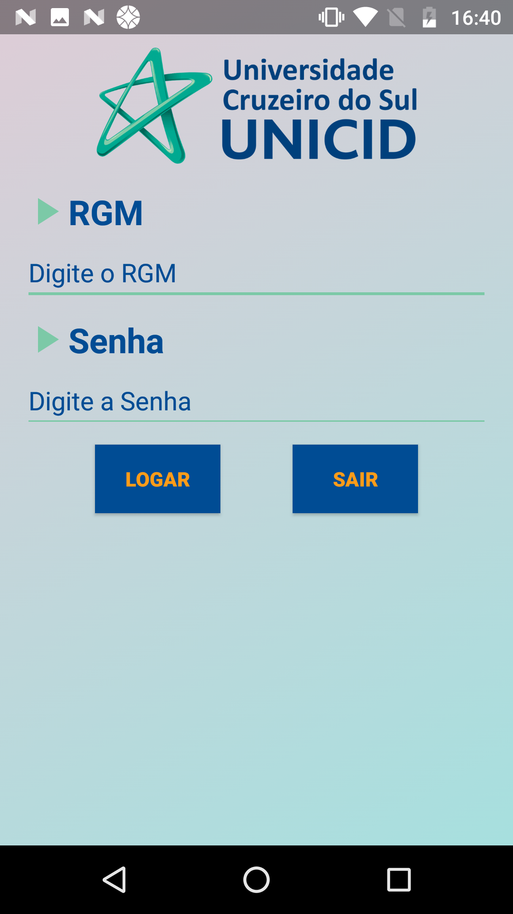
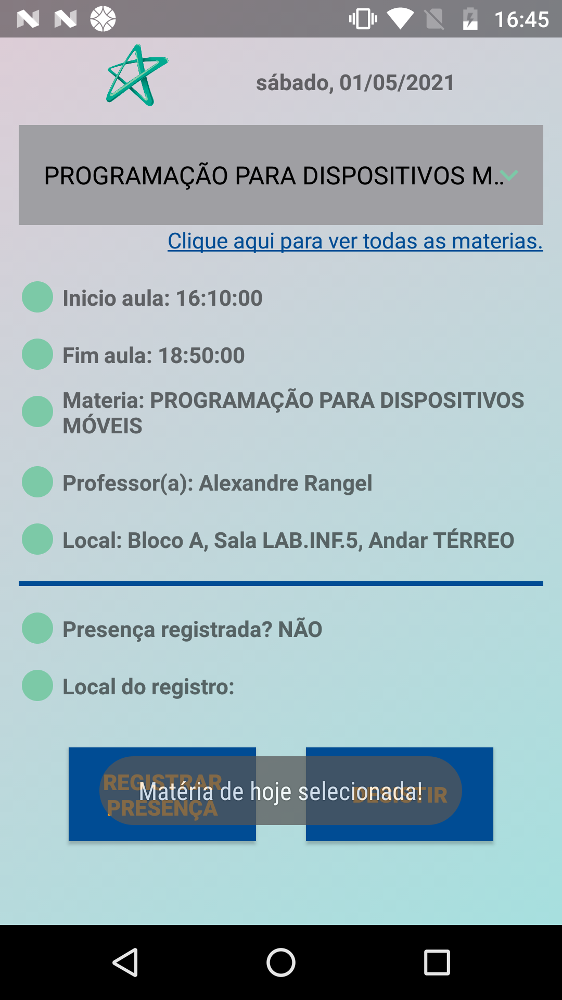
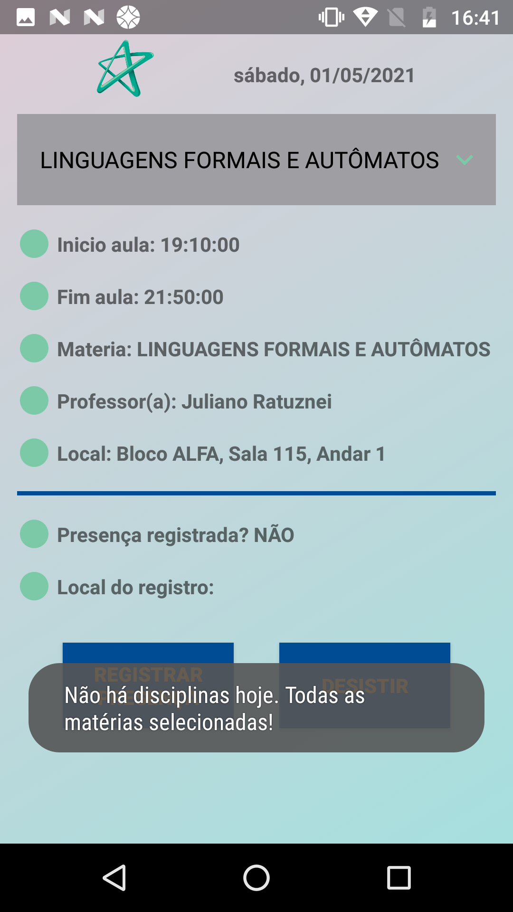
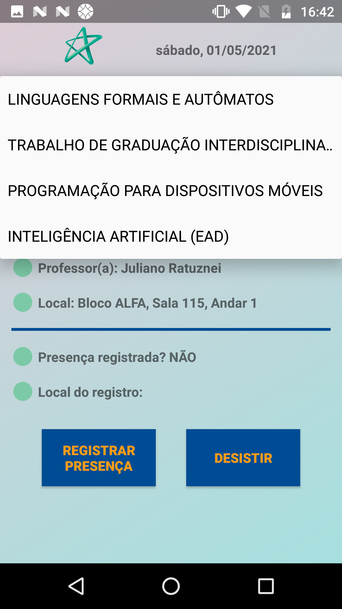
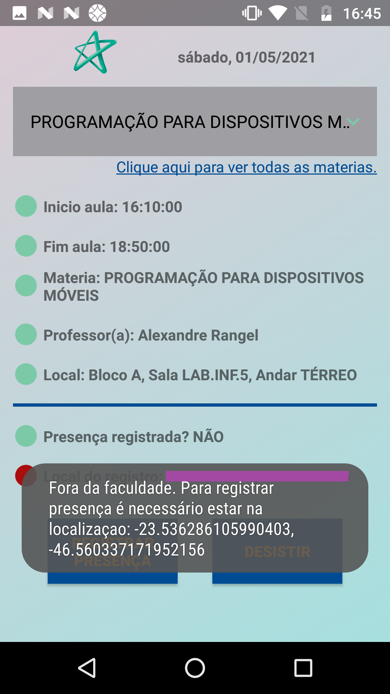
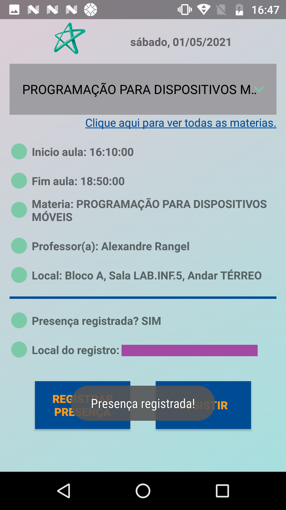
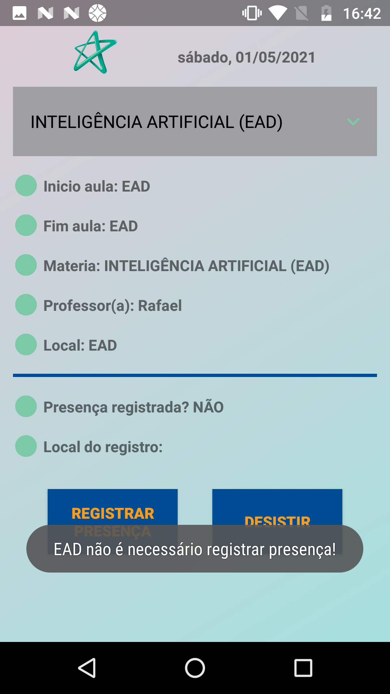

# Registra Presença de Alunos

## Introdução
O projeto <i><b>Registra-Presenca-Alunos</b></i> foi desenvolvido como um projeto escolar referente ao curso de Ciências da Computação na universidade UNICID.
O intuito deste projeto é fazer com que os alunos consigam registrar sua presença a partir de seus celulares.

### Como funciona?
A partir do celular, caso o aluno possuir cadastro, o mesmo irá conseguir registrar sua presença a partir 3 parâmetros:

* O horário atual está entre o <b>horário ínicio</b> e <b>horário fim</b> da aula;
* O <b>dia da semana atual</b> seja o mesmo que o <b>dia da semana da aula</b>;
* A localização do celular seja a mesma da faculdade.

Abaixo algumas imagens do sistema em funcionamento e alguns comentários referentes as respectivas telas.

### Imagens do programa
<table>
  <tr>
    <td>A primeira tela é a de login. Para prosseguir é necessário preencher login e senha que possuem cadastro.</td>
    <td>Após logar-se, caso houve aula na data de hoje, a disciplina será carregada automaticamente.</td>
  </tr>
  <tr>
    <td></td>
    <td></td>
  </tr>

  <tr>
    <td>Após logar-se, caso não houver aula na data de hoje, será carregado todas as disciplinas.</td>
    <td>Onde será possível escolher qualquer disciplina na seleção.</td>
  </tr>
  <tr>
    <td></td>
    <td></td>
  </tr>

  <tr>
    <td>Para registrar presença, além de estar dentro do período da aula, o aluno precisa estar no local da faculdade.</td>
    <td>Caso o aluno estiver dentro do período da aula e no local da faculdade, a presença será registrada.</td>
  </tr>
  <tr>
    <td></td>
    <td></td>
  </tr>

  <tr>
    <td>Quando a matéria for EAD, o aluno não irá precisar registrar presença.</td>
  </tr>
  <tr>
    <td></td>
  </tr>
 </table>

## Algumas limitações

* Da maneira que o software foi desenvolvido, o aluno não pode ter mais de uma aula no mesmo dia;
* O programa foi desenvolvido utiliza listas ao invés de banco de dados;
* O aluno só irá conseguir registrar presença se estiver exatamente na longitude e latitude da faculdade, caso contrário não irá registrar. Não foi desenvolvido para considerar o local exato da sala de aula.

## Como utilizar [Android]

* O programa foi construído para funcionar para Android que esteja no mínimo na versão 5.0 (Lollipop), SDK 21;
* Para testar o programa, basta baixar o .zip no GitHub;
* Descompactar o .zip;
* Abrir o programa com o Android Studio;
* Executar o programa.

## Considerações finais

Peço que se possível, caso tiver interesse no programa e realizar o download, deixe uma avaliação e caso encontrar qualquer tipo de problema, me informe para poder corrigí-lo.

Agradeço a todos pela atenção!

Atenciosamente,
Sidnei G. de Azevedo Júnior.